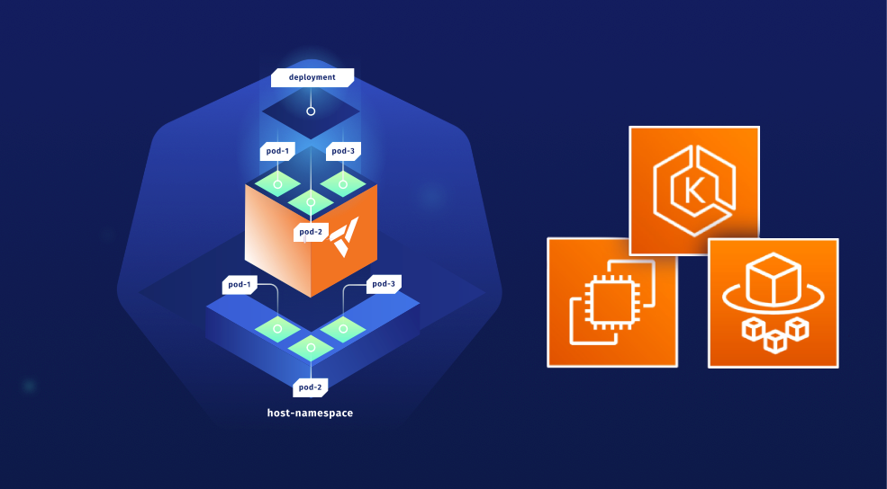

<p align="center">
  <a href="https://dev.to/vumdao">
    
  </a>
</p>
<h1 align="center">
  <div><b>Multi-Tenancy In EKS Cluster Using Vcluster</b></div>
</h1>

## Abstract
- Why should we consider using Vcluster? Our requirement is to establish multiple environments for developers to facilitate development, testing, as well as regression and performance tests.
- The crucial aspect is ensuring that these environments closely mimic the structure of our staging and production environments, which are based on Kubernetes. Instead of relying on Kubernetes namespaces to create these environments, We opt to offer developers a solution that provides them with an environment that closely resembles a real Kubernetes cluster. This is where Vcluster comes into play.

## Table Of Contents
- [Abstract](#abstract)
- [Table Of Contents](#table-of-contents)
- [🚀 **vcluster overview** ](#-vcluster-overview-)
- [🚀 **Bootstrap EKS cluster using CDK EKS Blueprints** ](#-bootstrap-eks-cluster-using-cdk-eks-blueprints-)
- [🚀 **Create vcluster** ](#-create-vcluster-)
- [🚀 **Expose vcluster using Network Laoad Balancer** ](#-expose-vcluster-using-network-laoad-balancer-)
- [🚀 **Cleanup** ](#-cleanup-)

---

## 🚀 **vcluster overview** <a name="vcluster-overview"></a>
- https://www.vcluster.com


## 🚀 **Bootstrap EKS cluster using CDK EKS Blueprints** <a name="Bootstrap-EKS-cluster-using-CDK-EKS-Blueprints"></a>
- The bootstrap provisions EKS cluster with required AddOns using [CDK EKS blueprints](https://github.com/aws-quickstart/cdk-eks-blueprints/tree/main)
  ```
    new VpcCniAddOn(),
    new MetricsServerAddOn(),
    new KarpenterAddOn(),
    new AwsLoadBalancerControllerAddOn(),
    new EbsCsiDriverAddOn(),
  ```

- Cluster provider
  - Fargate to deploy Karpenter
  - Karpenter simplifies Kubernetes infrastructure with the right nodes at the right time.

## 🚀 **Create vcluster** <a name="Create-vcluster"></a>
- Create two vclusters with namepsace `app1` and `app2`
  ```
  $ ./demo/create-vcl.sh app1
  $ ./demo/create-vcl.sh app2
  ```

## 🚀 **Expose vcluster using Network Laoad Balancer** <a name="Expose-vcluster-using-Network-Laoad-Balancer"></a>
- Create NLB service
  ```
  ✗ k apply -f demo/app1/service.yaml
  service/app1-lb created

  ✗ k apply -f demo/app2/service.yaml
  service/app2-lb created

  ✗ k get svc -n app1 app1-lb
  NAME      TYPE           CLUSTER-IP       EXTERNAL-IP                                                                    PORT(S)         AGE
  app1-lb   LoadBalancer   172.20.150.105   k8s-app1-app1lb-bb32c11098-3381306256798df4.elb.ap-southeast-1.amazonaws.com   443:32392/TCP   30h

  ✗ k get svc -n app2 app2-lb
  NAME      TYPE           CLUSTER-IP      EXTERNAL-IP                                                                    PORT(S)         AGE
  app2-lb   LoadBalancer   172.20.78.127   k8s-app2-app2lb-4690ffbcfe-bfb88a1245728e8a.elb.ap-southeast-1.amazonaws.com   443:31510/TCP   49s
  ```

- Create CName record point to the NLB DNS
  ```
  ➜  multi-tenancy-in-eks-using-vcluster git:(master) ✗ ./demo/r53-record.sh create app2
  ➜  multi-tenancy-in-eks-using-vcluster git:(master) ✗ ping app2-eks.simflexcloud.com
  PING k8s-app2-app2lb-4690ffbcfe-bfb88a1245728e8a.elb.ap-southeast-1.amazonaws.com (13.250.162.120): 56 data bytes
  ```

- Now we can connect to the vcluster app1 and app2 using their expose endpoint
  - https://app1-eks.simflexcloud.com

  - https://app2-eks.simflexcloud.com
    ```
    ✗ vcluster connect app2 -n app2 --server=https://app2-eks.simflexcloud.com --update-current=false
    done √ Virtual cluster kube config written to: ./kubeconfig.yaml
    - Use `kubectl --kubeconfig ./kubeconfig.yaml get namespaces` to access the vcluster
    ```

## 🚀 Deploy applications on vcluster
- Deploy `echo` and `guestbook` project
  ```
  ✗ ka2 apply -f demo/app2/vcluster
  ingress.networking.k8s.io/echo created
  deployment.apps/echo created
  service/echo created
  ingress.networking.k8s.io/guestbook created
  service/redis-leader created
  deployment.apps/redis-leader created
  service/redis-follower created
  deployment.apps/redis-follower created
  service/frontend created
  deployment.apps/frontend created
  ```

- Get ALB DNS and point to the Web app endpoint
  - https://app1.simflexcloud.com

  - https://app2.simflexcloud.com
    ```
    ✗ ka2 get ingress
    NAME        CLASS   HOSTS   ADDRESS                                                          PORTS   AGE
    echo        alb     *       k8s-app2-dbb948e3be-939359744.ap-southeast-1.elb.amazonaws.com   80      10s
    guestbook   alb     *       k8s-app2-dbb948e3be-939359744.ap-southeast-1.elb.amazonaws.com   80      10s
    ✗ ./demo/r53-record.sh create app2 k8s-app2-dbb948e3be-939359744.ap-southeast-1.elb.amazonaws.com
    ```

## 🚀 **Cleanup** <a name="Cleanup"></a>
- Delete vcluster
  ```
  ✗ vcluster delete dev -n dev
  info   Delete vcluster dev...
  done √ Successfully deleted virtual cluster dev in namespace dev
  done √ Successfully deleted virtual cluster pvc data-dev-0 in namespace dev
  ```

- Destroy all AWS resources within this project

---
<h3 align="center">
  <a href="https://dev.to/vumdao">:stars: Blog</a>
  <span> · </span>
  <a href="https://github.com/vumdao/multi-tenancy-using-vcluster-in-eks">Github</a>
  <span> · </span>
  <a href="https://stackoverflow.com/users/11430272/vumdao">stackoverflow</a>
  <span> · </span>
  <a href="https://www.linkedin.com/in/vu-dao-9280ab43/">Linkedin</a>
  <span> · </span>
  <a href="https://www.linkedin.com/groups/12488649/">Group</a>
  <span> · </span>
  <a href="https://www.facebook.com/CloudOpz-104917804863956">Page</a>
  <span> · </span>
  <a href="https://twitter.com/VuDao81124667">Twitter :stars:</a>
</h3>